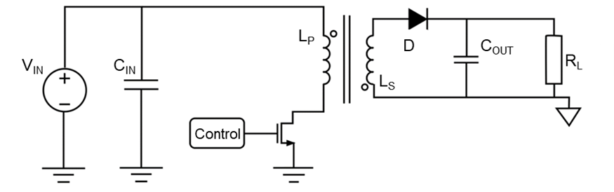

aka *isolated buck-boost converters*

relatively simple circuits that aim to provide a regulated voltage output, while also reducing [EMI](electromagnetic-interference.md) 

**Figure 1:** Flyback Converter Topology (image from [here]( https://www.monolithicpower.com/en/learning/resources/an-introduction-to-flyback-converters-parameters-topology-and-controllers))

Vin
- input voltage, source of electric power for the circuit
Cin/Cout
- energy storage capacitors for Vin and Vout respectively
Control
- a signal that comes from the IC controller, switches the main MOSFET to be on, allowing for current to flow through Lp
Lp and Ls
- primary and secondary inductors
- coupled together
- Vout is determined by the number of turns in their winding
- need a refresher on inductors? click [here](inductors.md)
D
- a diode which *rectifies* Vout by converting the alternating current (AC) to direct current (DC)
	- diodes only allow current to flow in one direction

more in depth reading:
- https://www.monolithicpower.com/en/learning/resources/an-introduction-to-flyback-converters-parameters-topology-and-controllers
