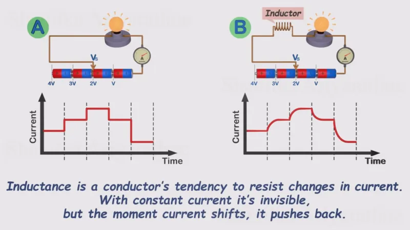
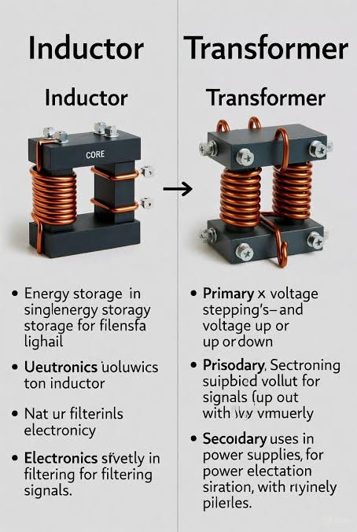

inductors resist changes in current. can be thought of as a water wheel (we love water analogies apparently) when water starts flowing, the waterwheel "opposes" the flow of water a little bit, then it eventually gets up to speed with the flow of water. when the flow of water stops, it takes a little bit of time for the wheel to stop spinning. the wheel pushes a little bit more water and eventually stops when the water flow is stopped.

**Figure 1.**  basic inductor graphs! from [hackaday](https://hackaday.com/2026/02/05/a-deep-dive-into-inductors/)

you can kind of think about it like the electrical equivalent to mechanical energy. just like how mass resists changes in velocity, inductors resist changes in current.

you can make ***transformers***, which is when you have two inductors where energy is transferred from the first to the second inductor
- inductors in transformers share a magnetic core
- no gaps between winding and magnetic core
- energy is NOT stored in this core
- deliver power in real time
- typically used for AC to AC conversion

you can also make ***coupled inductors***, which are similar in that:
- also has a magnetic core
HOWEVER
- there is a gap between winding and magnetic core, which allows for energy storage in the form as *magnetic flux* within this gap
- used typically in DC to DC converters, stepping down higher DC voltages to lower DC voltages
	- one subset/type of coupled inductors is the [flyback transformer](flyback-transformer.md)

additional reading:
- about inductors in general
	- https://electronics.howstuffworks.com/inductor.htm 
- difference between transformers and inductors
	- https://www.hwe.design/theories-concepts/transformer-vs-coupled-inductor

i was doing research for this page and ran into this on facebook and its clear that i have stayed up too late because i keep reading it and its funnier each time. i hope someone reads this. i **love it** when i *singlenergy storagy*

