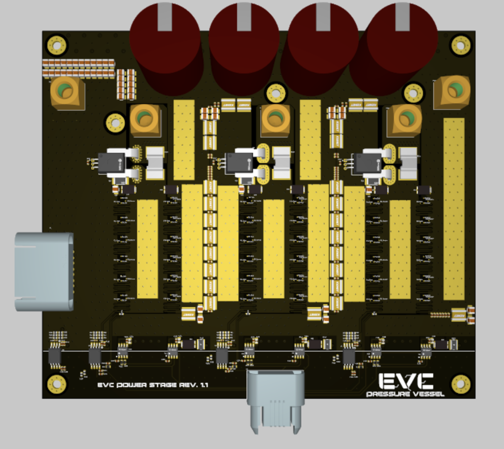
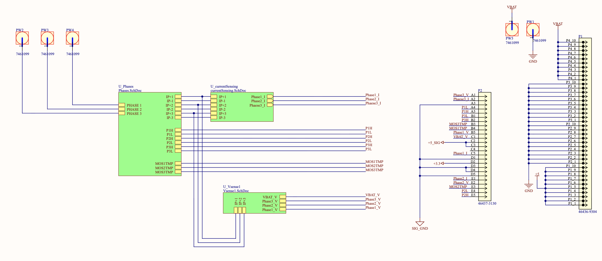

## power stage 

**top level schematic:**

**signal definitions**
PHASE 1-3
- actual 3 phase cables that get connected to the motor

IP +/- 1-3 
- high side (+) and low side (-) voltage and current sensing for each of the phases

P 1-3 H/L
- PWM (H) and its complement/inverse signal (L) for each of the phases
- each pair connected to their respective [half-bridge](../learning-materials/half-bridge.md)

MOS 1-3 TMP
- thermistor temp sensors for each of the phases

PHASE1-3_I
- analog output ultimately for MCU to read based on input to the hall effect current sensor (IP +/- 1-3)

PHASE1-3_V
- analog output also for MCU to read based on input to isolation amplifier

VBAT_V
- voltage sense for battery voltage, functions similarly to how phase voltage sense works
