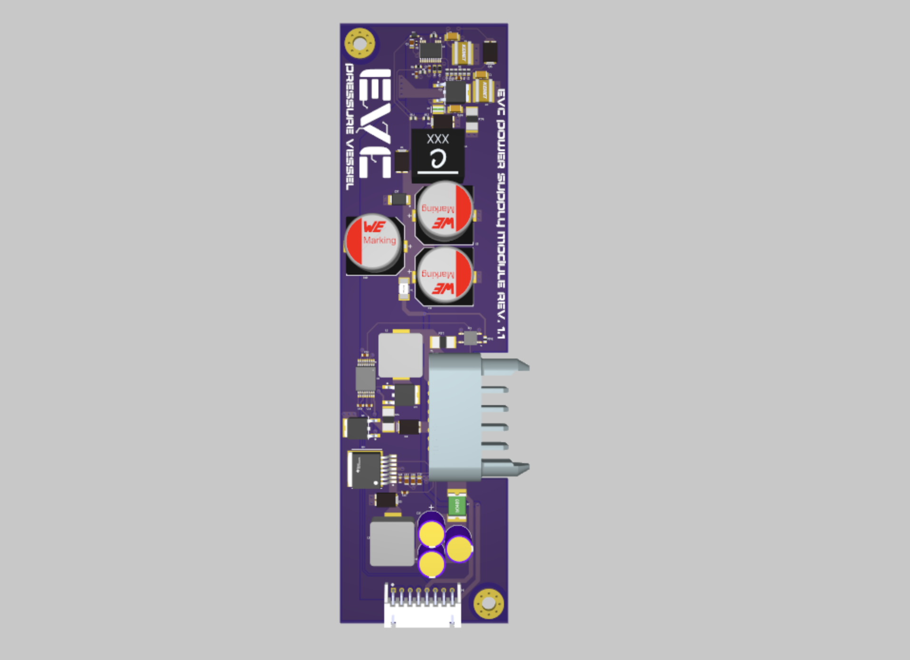
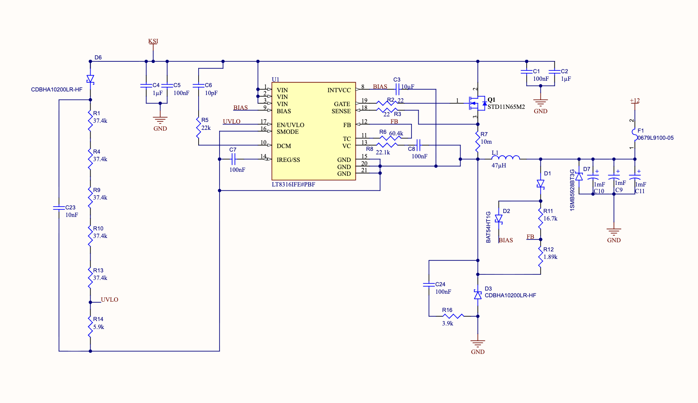

## power supply 

the power supply project file schematics are set up as a *flat* schematic (as opposed to hierarchical, like the [power stage](power-stage.md)). this means that there is no top sheet/hierarchy. below listed are the different sheets and what the functionality of the circuits on each are

## sheet name: LT8316

contains the [LT8316](https://www.snapeda.com/parts/LT8316IFE%23PBF/Analog+Devices/view-part) which is a *560VIN Micropower No-Opto Isolated Flyback Controller*. 
- 560VIN
	- this is in reference to the input voltage range, which is from 16V to 560V (600V max)
- micropower
	- referring to the fact that this chip has very low power dissipation (when the chip isn't actively doing anything it enters a standby mode that has a lower switching frequency and quiescent/"inactive" current) 
- no-opto isolated
	- this means that this chip isn't isolating its output through something like an [optocoupler](../learning-materials/optocoupler) but rather it works by looking at the flyback pulse waveform that appears on the tertiary winding on the transformer. 
	- learn more about galvanic isolation [here](../learning-materials/galvanic-isolation.md)
- flyback controller
	- the main attraction
	- means that this chip regulates power in a [switch-mode power supply](../learning-materials/switch-mode-power-supply.md) that uses a coupled inductor ([flyback transformer](motor-controller-notes/learning-materials/flyback-transformer)) to store and transfer energy while providing   isolation between the input and output

the datasheet for the LT8316 can be found [here](https://www.analog.com/media/en/technical-documentation/data-sheets/lt8316.pdf)

## sheet name: Precharge_Controller

contains two main pieces:
- precharge controller (TPSI31P1-Q1)
- relay (CPC1150N)

the precharge controller basically lets us turn on q2 and q3 in a controlled manner through L2 (from VBAT to KSI). we like not just bare connecting our VBAT to KSI because that would mean we are going from no current to a bunch of current (called *inrush current*) which can damage cables, connectors or fuses. 

we can ask for this precharging process to begin by sending a high signal from our MCU (Precharge EN). 

its also pretty smart in that it measures the voltage across the shunt resistor r15 (with IS+ and VSSS) to basically get an understanding of how much current is actually flowing from VBAT to KSI. if its too much, almost certainly bad things are happening, and we do NOT want to continue the precharge process. when the voltage exceeds this acceptable threshold, VDRV (connected to the gate of q2) is held low, preventing current from flowing.

the relay at the bottom is *normally closed*. what this means for us is that if the board is fully powered off (ie the control signals at pins 1 and 2 are not on) then VBAT is connected to ground through the relay with that 2k ohm resistor. this allows for the slow discharge of whatever capacitors that are on out VBAT net when the motor controller is off. this is awesome because we don't really love it when there is lingering stored electrical energy. 

precharge controller datasheet [here](https://www.ti.com/lit/ds/symlink/tpsi31p1-q1.pdf?ts=1789670651046)

normally closed relay datasheet [here](https://www.littelfuse.com/assetdocs/littelfuse-integrated-circuits-cpc1150n-series-datasheet?assetguid=7f3e9a05-5c4a-493e-bfe5-2075df32c7f9)

