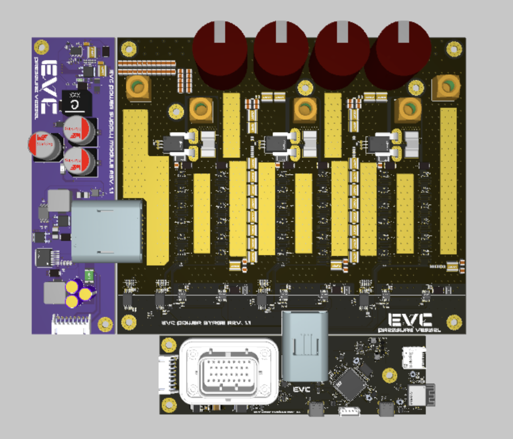
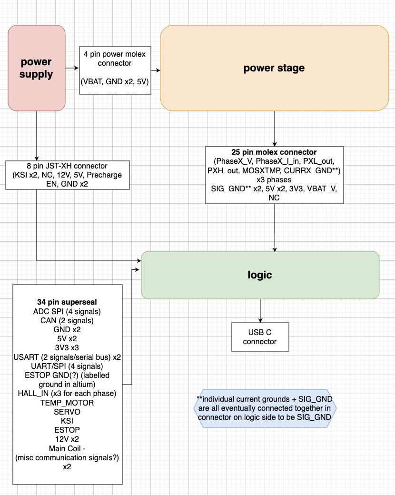
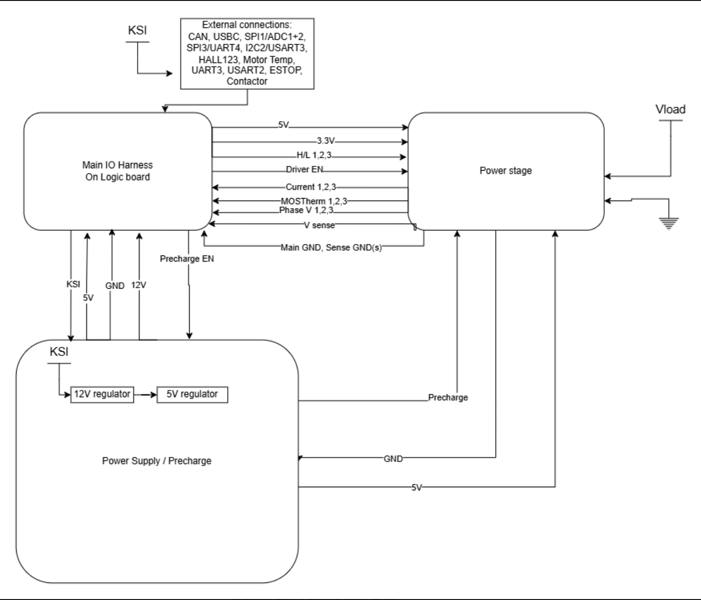

above pictured the three boards that make up the motor controller
(left/purple is [power supply](power%20supply.md))
(large squarish platform in the center is the [power stage](power%20stage.md))
(bottom black pcb/rectangle is [logic](logic.md))

**internal architecture/flow diagram (WIP):**

arrows of signals aren't really faithful to origin/destination of signal, but the general idea of what the connections between the boards mean should be accurate

**legacy diagram:**

**board list:**
[power supply](power%20supply.md)
[logic](logic.md)
[power stage](power%20stage.md)